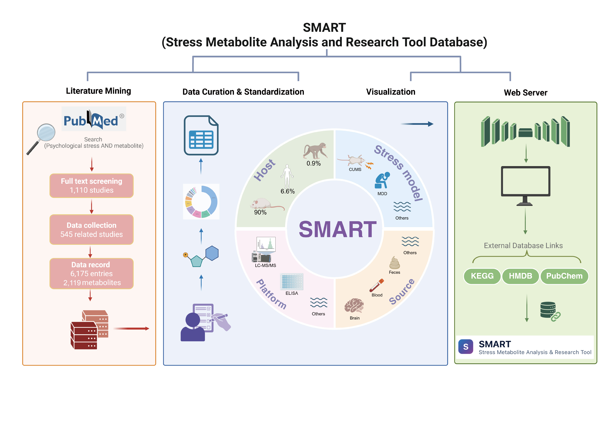

# SMART: Stress Metabolite Analysis and Research Tool

**SMART** is a manually curated database that integrates published evidence on metabolite alterations associated with psychological stress across different host species, stress models, biological sources, and analytical platforms.

Psychological stress has been associated with a wide range of mental and physical disorders, yet metabolomic evidence remains scattered across different studies, tissues, species, and experimental models. SMART was developed to systematically organize these findings and provide a centralized resource for exploring **stress–metabolite associations**.



---

### [Explore the SMART database](https://db.hscmdb.com/)

The web resource supports interactive exploration, while this GitHub repository provides supporting documentation, metadata, literature-screening information, and analysis scripts.

---

## Database Overview

SMART currently contains:

- **1,110 publications screened**
- **545 eligible studies curated**
- **6,175 stress-associated metabolite entries**
- multiple **host species**, including humans, rats, mice, and other experimental models
- multiple **stress paradigms**
- multiple **biological sources**, including brain, blood, feces, urine, gastrointestinal tissues, liver, and others
- multiple **analytical platforms**, including mass spectrometry- and NMR-based metabolomics
- information on the **direction of metabolite change** under stress

Each curated record is linked to its original publication and annotated using standardized metadata wherever possible.

---

## What Information Does SMART Contain?

SMART integrates information at both the **study level** and the **metabolite-observation level**.

| Category | Information |
|---|---|
| Literature | PMID, publication year, article title |
| Study design | Study type, host species, host category |
| Stress exposure | Original and standardized stress models, stress type |
| Metabolite | Original and standardized metabolite names |
| Biological source | Original sample type and standardized source category |
| Analytical method | LC-MS, GC-MS, NMR, and other platforms |
| Regulation | Up- or down-regulation under stress |
| Comparison | Original comparison groups reported in the study |

The basic unit of SMART is **one metabolite-change observation**. Therefore, a single publication may contribute multiple entries when it reports multiple metabolites, sample sources, stress conditions, analytical platforms, or comparison groups.

---

## What Can SMART Be Used For?

SMART can be used to:

- identify metabolites repeatedly associated with psychological stress;
- examine published evidence for individual stress-associated metabolites;
- explore the biological sources in which metabolite changes have been reported;
- compare stress-associated metabolic evidence across host species and stress models;
- identify candidate metabolites for experimental validation;
- generate hypotheses for stress-related metabolic research.

---

## Repository Contents

| Directory / File | Description |
|---|---|
| `data/` | PubMed search strategy, retrieved records, and literature-screening information |
| `metadata/` | Data dictionary, extraction template, metabolite identifiers, and synonym mappings |
| `scripts/` | R scripts used for summary analyses and visualization |
| `Figure_abstract.jpg` | Graphical overview of the SMART database |
| `CHANGELOG.md` | Repository update history |
| `CONTRIBUTING.md` | Guidance for suggesting corrections or new studies |
| `LICENSE` | Terms for reuse of code and curated data |

### Repository structure

```text
SMART/
├── README.md
├── LICENSE
├── CHANGELOG.md
├── CONTRIBUTING.md
├── VERSION
│
├── data/
│   ├── 01_pubmed_search_strategy.csv
│   ├── 02_pubmed_records_1110.csv
│   └── 03_screening_exclusion_summary.csv
│
├── metadata/
│   ├── 01_Data_dictionary.xlsx
│   ├── 02_Data_template.xlsx
│   ├── 03_Metabolite_identifiers.csv
│   └── 04_Metabolite_synonyms.csv
│
├── scripts/
│   ├── 01_plot_bar_chart.R
│   ├── 02_plot_heatmap.R
│   ├── 03_plot_pie_chart.R
│   ├── 04_plot_sankey.R
│   ├── 05_plot_two_side_bar_chart.R
│   ├── 06_plot_upset.R
│   ├── 07_plot_volcano_host.R
│   └── 08_plot_volcano_sample_source.R
│
└── Figure_abstract.jpg

---

## Curation workflow

The SMART curation workflow can be summarized as:


PubMed literature search
        ↓
Initial literature screening
        ↓
Study-level information extraction
        ↓
Metabolite-level observation extraction
        ↓
Metabolite-name harmonization
        ↓
Tissue / stress model / platform standardization
        ↓
SMART database
```

---

## Contact

For questions, data corrections, or suggestions of relevant studies, please open a GitHub Issue or contact the SMART development team.

---